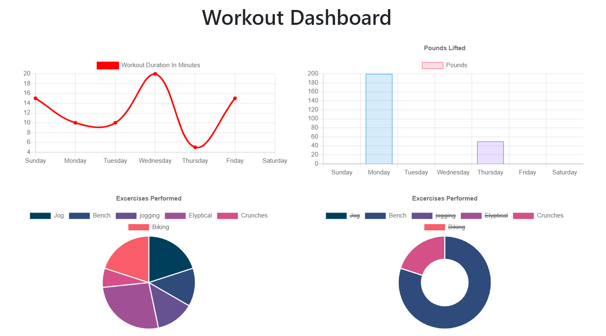

# Title

MongoDB Fitness Tracker

This application allows the user to create and view data on their workouts. Workouts can be continued, or a new one can be started each time including cardio and strength training workout types. Data statistics can then be viewed as graphs.

# Installation

A live deployment can be found here: <a href="https://mongo-fitness-tracker109.herokuapp.com/">https://mongo-fitness-tracker109.herokuapp.com/</a>

To install locally use the following steps.

<ol>
    <li>Download the files from Github</li>
    <li>Install and setup Node.js</li>
    <li>Install and setup NoSQL booster for MongoDB (or setup with cloud hosting)</li>
    <li>Open the downloaded files with VS code.</li>
    <li>Open the terminal while viewing the files (CTRL + `)</li>
    <li>Run the command npm install in your terminal</li>
    <li>Edit line 16 of server.js with your MongoDB details</li>
    <li>Run the database seed with the command npm run seed in your terminal</li>
    <li>Open the index.html file in browser</li>
</ol>

## Built With
<ul>
<li>Semantic UI - CDN included</li>
<li>Node.js and the following packages</li>
<ul>
<li>Mongoose - Installed via Node</li>
<li>Express - Installed via Node</li>
<li>Morgan - Installed via Node</li>
</ul>
</ul>

## Code Overview

The pages are rendered and styled by Semantic UI and the .css/.html files in the public folder. The back end and database connections are handled by the js files in the routes folder connected to the server.js file. Each page has it's own .js file in the public folder to create and functionalize the user interface, along with the api.js file which works to connect with the API routing for asynchronous back end routes. The models folder defines the schema for an exercise.
